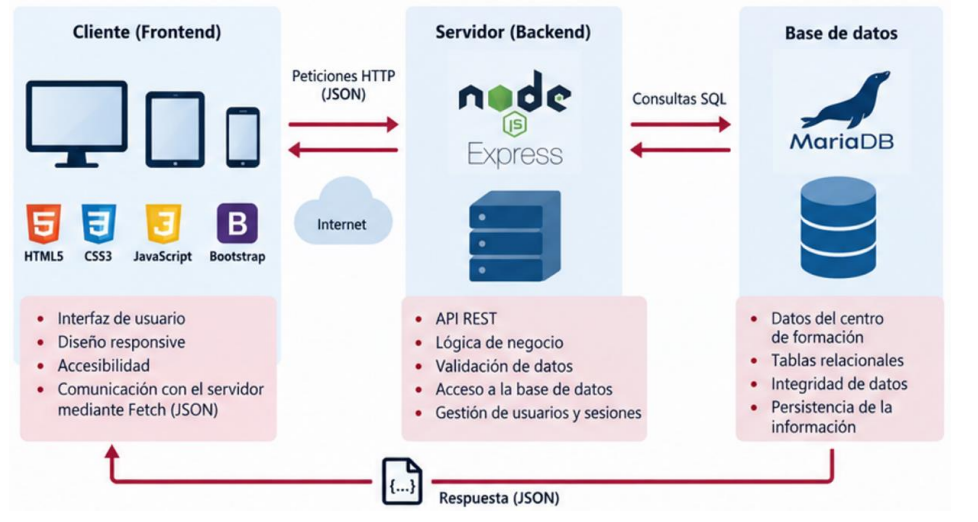

# Proyecto de AW: Centro de Formación
En este proyecto vamos a realizar un centro de formación que maneja cursos, matrículas... Habrá dos tipos de usuarios: **Alumnos** y **Administradores**.

## Arquitectura de la aplicación
La arquitectura va ser tipo **cliente-servidor**, las tecnologías que se van usar son:

### Frontend
1. HTML
2. CSS
3. JS
4. Bootstrap 5

### Backend
1. Node.js
2. Express 5
3. API Rest

### Base de datos
MariaBD

### Entorno
Para el desarrollo se usara **VSCode** y **XAMPP**. Como recomendación de extensiones parea VSCode usa:
- Live Server